# 📌***Seção 1 => Introdução***

### 📊 ***O que é Business Intelligence?***

Business Intelligence (BI) é um conjunto de técnicas e ferramentas utilizadas para transformar dados em informações úteis para a tomada de decisão empresarial. BI permite aos usuários analisar dados de diferentes fontes, criar relatórios e visualizações e monitorar indicadores-chave de desempenho (KPIs) para ajudar a identificar tendências e oportunidades.

### 🌎 ***O que é Big Data?***

Enquanto Big Data se refere a grandes quantidades de dados, provenientes de uma variedade de fontes e com diferentes formatos.

A capacidade de processar grandes quantidades de dados é uma das principais vantagens do Big Data, pois permite coletar e armazenar dados de muitas fontes diferentes, incluindo transações de negócios, dados de redes sociais, registros de sensores e outros tipos de dados não estruturados. BI usa esses dados para criar insights e entender tendências que podem ser usadas para melhorar a eficiência e rentabilidade dos negócios.

Portanto, Big Data é uma fonte de informação para Business Intelligence e as ferramentas de BI foram se adaptando para lidar com essa quantidade de dados.

### 🔬 ***O que é Data Science?***

Data Science (Ciência de Dados) é um campo interdisciplinar que combina matemática, estatística e computação para extrair conhecimento e insights úteis a partir de grandes conjuntos de dados.

Os profissionais de Data Science usam técnicas de análise estatística, mineração de dados, aprendizado de máquina e Inteligência Artificial para explorar e entender os dados, criar modelos para prever resultados e comunicar os insights obtidos para ajudar na tomada de decisão. Data Science é amplamente utilizada em vários setores, como finanças, saúde, marketing, varejo e tecnologia.

### 📈 ***O que é Microsoft Power Bi?***

Microsoft Power BI é uma plataforma de Business Intelligence (BI) da Microsoft que permite aos usuários visualizar e analisar dados de diferentes fontes, criar relatórios e dashboards interativos e compartilhar insights com outros usuários.

O Power BI permite que os usuários conectem-se a diversas fontes de dados, incluindo planilhas, bancos de dados, serviços de nuvem e aplicativos, e transformem esses dados em informações valiosas.

Com o Power BI, os usuários podem importar, limpar, transformar e modelar dados, criar relatórios e visualizações e publicá-los em um ambiente compartilhado (na versão paga). Ele também tem recursos avançados como dashboards interativos, análise de dados, Inteligência Artificial e automatização de relatórios.

# 📌 ***Seção 2 => Primeiro passos com o Microsoft Power BI***

O Power Query é o motor de tratamento de dados integrado ao Power BI, funcionando como uma ferramenta de ETL (Extrair, Transformar e Carregar)e permite realizar ações como:

- Limpeza: Remover linhas em branco, colunas desnecessárias ou erros de formatação.
- Transformação: Alterar tipos de dados (ex: converter texto em data), mesclar tabelas e dividir colunas.
- Conexão: Unir dados de fontes distintas, como um arquivo Excel com um banco de dados SQL ou dados da web.
- Automação: Todas as etapas de limpeza são gravadas. Quando os dados de origem mudam, basta clicar em "Atualizar" para que o Power Query execute todos os passos de tratamento automaticamente.

### 📊 ***Qual gráfico escolher para montar ?***

Será muito relativo de quais informações você vai precisar mostrar dentro do power bi, por exemplo de uma informação com apenas 1 valor pode ser usado o cartão; Logo, uma informação cuja precisa 2 informações e categorias ,gráfico de pizzas e assim vai.

# 📌***Seção 3 => Modelagem, Relacionamento e DAX***

### 🏗 ***Que é Modelagem de dados ?***

Processo de criar uma representação visual ou esquema, que define os sistemas de coleta e gerenciamento de informações de qualquer organização

Modelagem de dados é o processo de criação de um modelo conceitual, lógico e físico de dados.

- **Conceitual**, define os conceitos e as relações entre os dados;
- **Lógico**, especifica como os dados serão armazenados e como as relações serão representadas em um banco de dados;
- **Físico**, descreve como os dados serão armazenados em um sistema de armazenamento específico.

**Business Intelligence (BI)**, ou **Inteligência de Negócios**, combina análise de negócios, mineração de dados, visualização de dados, ferramentas/infraestrutura de dados e práticas recomendadas para ajudar as organizações a tomar decisões impulsionadas por dados.

O foco em Bi é analisar o passado compreendendo métricas, indicadores, padrões e relacionamentos. Objetivo maior é a análise descritiva do que aconteceu.

### ***Como Aplicamos Modelagem de Dados em Business Intelligence?***

---

Ela ajuda a garantir que os dados sejam armazenados de forma organizada e consistente, o que facilita a recuperação e análise dos dados. Algumas das maneiras como a modelagem de dados pode ser usada em BI incluem:

- **Criação de um Data Warehouse (DW):** A modelagem de dados é usada para criar um DW, que é um repositório centralizado de dados de negócios que é usado para suportar a análise e tomada de decisão.
- **Criação de Modelos Estrela (Star Schema):** A modelagem de dados estrela é uma técnica comumente usada para projetar DWs, que ajuda a garantir a consistência e a facilidade de acesso aos dados.
- **Design de cubos multidimensionais:** Modelagem de dados é usada para projetar cubos multidimensionais, que são estruturas de dados que ajudam a agregar e analisar dados de várias fontes.
- **Otimização de consultas:** Modelagem de dados também é usada para otimizar as consultas a um DW, garantindo que as consultas sejam executadas de forma eficiente.
- **Integração de dados:** Modelagem de dados é usada para integrar dados de várias fontes, garantindo a consistência e a qualidade dos dados.
- **Governança de dados:** Modelagem de dados também é importante para garantir a qualidade dos dados e para implementar medidas de governança de dados, como rastreamento de alterações e auditoria.

### ***Quais os benefícios da Modelagem de Dados ?***

- Importação de dados;
- Criação de tabelas e relações;
- Medidas e Cálculos;
- Filtros e Segmentação;
- Publicação de relatórios e dashboards;

## 🖇 ***Cardinalidade***

- Um para Um (**1 : 1**), Um elemento se relaciona com **apenas um** do outro lado.

***Exemplo:***

Uma **Pessoa** tem **um** **CPF**

Um **CPF** pertence a **uma** pessoa

- Um para Muitos (**1 : N**), Um elemento pode se relacionar com **vários**, mas o outro lado só com **um**.

Exemplo:

Um **Cliente** pode fazer **vários Pedidos**

Cada **Pedido** pertence a **um único Cliente**

- Muitos para Muitos (**N : N**), Vários elementos se relacionam com vários do outro lado.

Exemplo:

Um **Aluno** pode cursar **várias Disciplinas**

Uma **Disciplina** pode ter **vários Alunos**

⚠️ No banco de dados, esse tipo geralmente precisa de uma **tabela intermediária**.

## 🧹 ***Linguagem M***

### Serve para buscar, limpar e transformar dados

- Usada no **Power Query**
- Atua **antes** dos dados entrarem no modelo
- Ideal para:
    - Importar dados (Excel, CSV, banco de dados, API)
    - Limpar dados (remover colunas, corrigir erros)
    - Transformar dados (trocar tipos, juntar tabelas, filtrar linhas)

Pense assim: **Linguagem M = faxina nos dados**

**Exemplo simples:**

- Remover linhas vazias
- Trocar texto por número
- Unir duas tabelas

## 📐 ***Linguagem DAX***

### Serve para fazer cálculos e análises

- Usada no **Power BI**, **Power Pivot** e **Analysis Services**
- Atua **depois** que os dados já estão no modelo
- Ideal para:
    - Criar **medidas**
    - Criar **colunas calculadas**
    - Fazer **cálculos dinâmicos**

Pense assim: 📊 **DAX = matemática e análise dos dados**

**Exemplo simples:**

- Total de vendas
- Média de faturamento
- Crescimento mensal
- Percentual (%)

# 📌 ***Seção 4 => Power BI para Análise de Dados de Marketing***

🚨 **Outliers** no Power BI são *valores atípicos* ou pontos fora da curva que se destacam significativamente do restante de um conjunto de dados, podendo ser causados por erros de digitação, medição, coleta, ou representar eventos raros e importantes.

**(observar dentro de TRANSFORMAR DADOS)**

# 📌 ***Seção 5 => Power BI para Análise de Dados de Comercial***

- Aprendemos a usar a navegação por páginas. Fazemos a criação das páginas e no final indo em **INSERIR > BOTÃO > NAVIGATOR > NAVEGAR POR PÁGINA.** E para fazer a navegação usamos a tecla ctrl mais o clique.

# 📌 ***Seção 6 => Power BI para Análise de Recursos Humanos***

- Fazemos a criação de Medidas Dax, incluindo várias medidas, de acordo com as funções que o power BI possui e com os campos exportados DatasetRH.
- Criamos condição se a pessoa pode considerar Promoção ou não. indo em **OBTER DADO > ADICIONAR COLUNAS > COLUNA CONDICIONAL.** Irá criar uma coluna mostrando se considera ou não a partir da condição que determinei
- Para adicionar o simbola de porcentagem no dado, ir na exibição de modelo > clica em qual campo deseja por > formatação e por porcentagem

# 📌 ***Seção 7 => Power BI para Análise de Recursos Humanos***

- Alterando Fonte de Dados no Projeto: **ARQUIVO > OPÇÕES E CONFIGURAÇÕES > CONFIGURAÇÕES DA FONTE DE DADOS**

# 📌 ***Seção 11 => Estatísticas Fundamental para Data Science***

📊 **DEFININDO ESTATÍSTICAS:**

- A Estatística Descritiva foca na organização, resumo e apresentação dos dados de maneira eficiente, utilizando gráficos, tabelas e medidas numéricas como média, mediana, moda, variância e desvio padrão.
- A Estatística Inferencial, por outro lado, utiliza técnicas e métodos para fazer generalizações e previsões a partir de dados amostrais, permitindo inferências sobre uma população maior. A Estatística Inferencial envolve o uso de testes de hipóteses, intervalos de confiança e análise de regressão, entre outras técnicas.
- Normalmente um Analista de Dados trabalha com Estatística Descritiva no seu dia a dia,enquanto um Cientista de Dados trabalha com Estatística Descritiva e Estatística Inferencial no seu dia a dia.

📘 **ESTATÍSTICAS DESCRITIVA:** A Estatística Descritiva é responsável pelo resumo, organização e apresentação dos dados de maneira eficiente e informativa. Seu objetivo é fornecer uma compreensão clara e concisa dos dados  coletados  sem  fazer  suposições  sobre  a  população  maior.

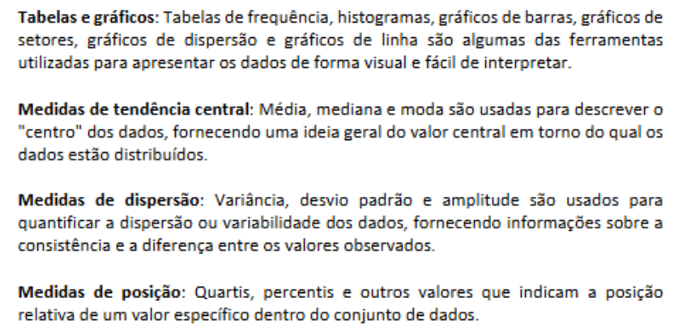

🔎 **ESTATÍSTICAS INFERENCIAL:** conjunto  de  técnicas  e métodos  usados  para  fazer generalizações e previsões sobre uma população com base em informações obtidas de uma amostra dessa população. A Estatística Inferencial permite estimar características da população, testar  hipóteses  e  fazer  previsões.

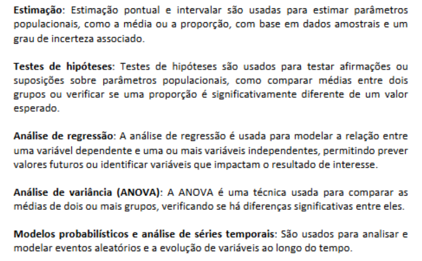

O Power BI NÃO é uma ferramenta para Estatística Inferencial. Ou seja, o Power BI é uma ferramenta de Business Intelligence (onde usamos Estatística Descritiva) não de Data Science (onde  usamos  Estatística  Inferencial).

📦 **BIG DATA ANALYTICS:** Big  Data  Analytics é  o  processo  de examinar,  analisar  e  extrair informações  valiosas  de grandes conjuntos de dados, conhecidos como Big Data. Esses dados são caracterizados por seu grande  volume,  variedade  e  velocidade,  o  que  os  torna  complexos  e  desafiadores  de  serem processados e analisados por métodos tradicionais.

Big  Data  Analytics  envolve  o  uso  de  técnicas  avançadas  de  análise  de  dados,  como aprendizado de máquina (Machine Learning), mineração de dados, processamento de linguagem natural (PLN) e análise de texto, bem como ferramentas e tecnologias especializadas para lidar com a escala e complexidade dos dados.

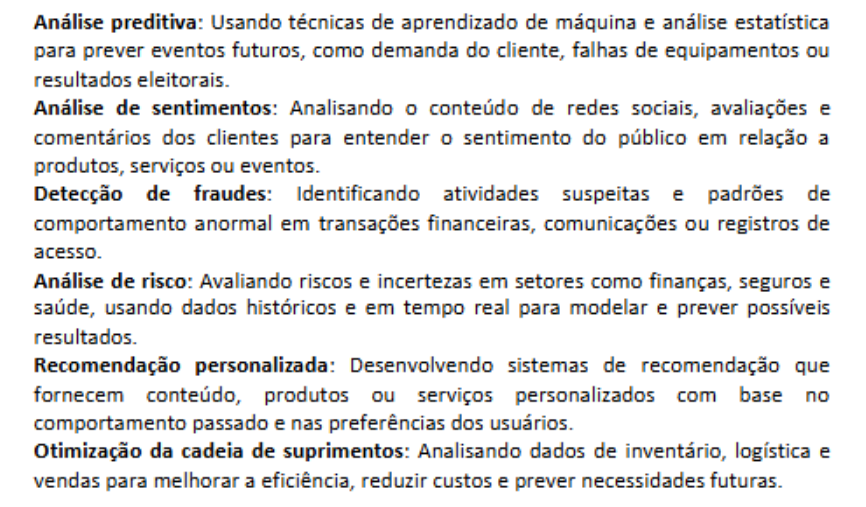

🎯 **PARÂMETRO x ESTATÍSTICA:**

- **PARÂMETRO,** Um parâmetro é uma medida numérica que descreve uma característica específica de uma população. Ele é um valor fixo e desconhecido, já que geralmente não é possível analisar todos os elementos da população. Os parâmetros são frequentemente representados por letras gregas, como μ (média populacional) e σ (desvio padrão populacional). Os parâmetros fornecem informações valiosas sobre a população e são o objetivo final de muitas análises estatísticas.
- **ESTATÍSTICA, Uma estatística é uma medida numérica calculada a partir de uma** amostra selecionada da  população.  As  estatísticas  são  usadas  para  estimar  parâmetros  populacionais  e  são representadas por letras latinas, como x̄ (média amostral) e s (desvio padrão amostral). Uma estatística é uma variável aleatória, já que seu valor varia de uma amostra para outra, e é possível calcular intervalos de confiança e margens de erro em torno dela.

**DADOS PRIMÁRIOS x SECUNDÁRIOS :**

- **PRIMÁRIOS, informações coletadas diretamente pelo pesquisador ou sua equipe** para responder a uma pergunta específica de pesquisa ou atender a um objetivo específico. Esses dados são coletados pela primeira vez e são originais, ou seja, não foram utilizados em pesquisas anteriores. Os dados primários são geralmente coletados por meio de métodos como entrevistas, questionários, observações, experimentos ou outros meios diretos de coleta de informações.

- **SECUNDÁRIOS, informações já coletadas e disponíveis, que foram obtidas ou** geradas  em  pesquisas  ou  projetos  anteriores,  ou  que  são  coletadas regularmente  por organizações ou agências. Esses dados não são coletados especificamente para a pergunta de pesquisa  em  questão,  mas  podem  ser  aplicados  ou  reutilizados  para responder  a  novas perguntas.  Os  dados  secundários  podem  incluir  relatórios  de  pesquisa,  estudos  acadêmicos, registros administrativos, dados de censo, informações financeiras e estatísticas governamentais, entre outros.

🧮 **VARIÁVEIS:**

- ***Qualitativas*** – utilizam termos descritivos para descrever algo de interesse. Ex: cor dos olhos, estado civil, religião, gênero, grau de escolaridade, classe social, tipo sanguíneo, cor da pele, etc...
- ***Quantitativas*** – representadas por valores numéricos que podem ser contados ou medidos. Ex: número de crianças em uma sala de aula, peso do corpo humano, idade, número de filhos, etc..

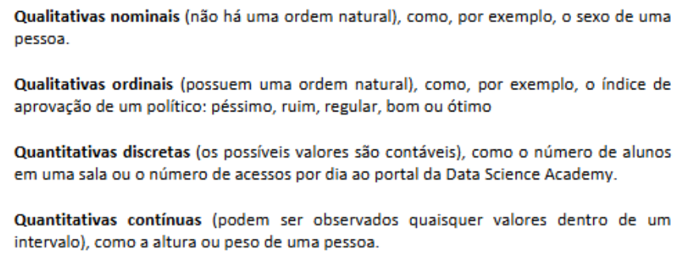

# 📌 ***Seção 12 => Limpeza e Manipulação de Dados com Power Bi***

Utilizando conta **DAX** para fazer ***moda***:

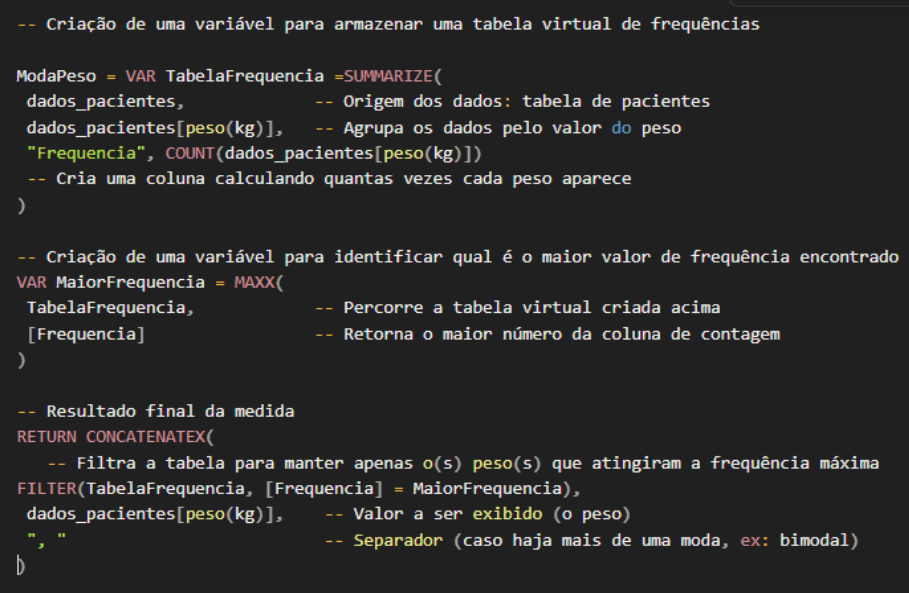

- Iremos fazer exercícios parar:
    - Identificação e tratamento de registros duplicados.

ID, duplicados a gente remove duplicação pois não existe ID iguais.

- Identificação e tratamento de valores ausentes.

Interpolação, preencher com outro valor (fazendo com critério, não aleatório). E neste caso ele pegou a Mediana e preencheu, em vez de fazer a exclusão da linha

- Identificação e tratamento de valores outliers.

São dados extremos que se desviam significativamente da maioria das observações em um conjunto, situando-se nas extremidades

# 📌 ***Seção 13 => Manipulação de Dados com Power Query M Language***

A  Power  Query  M  Language,  ou simplesmente  Linguagem  M,  é  uma  linguagem  de programação funcional é baseada em fórmulas usadas no Power Query, uma ferramenta de ETL (Extração, Transformação e Carga) que está presente no Power BI, Excel e outras ferramentas da Microsoft. A linguagem M permite que os usuários manipulem, transformem e preparem dados para análise e visualização.

A linguagem M é projetada para ser fácil de aprender, especialmente para pessoas que já têm experiência com o Excel. A sintaxe da linguagem é simples e concisa, o que permite realizar tarefas comuns de limpeza e transformação de dados de maneira rápida e eficiente

**VERIFICANDO QUALIDADE :**  Dentro do Power Query na aba Exibição, marcar checkbox e irá ver se as colunas possui alguma linha Vazio, Erro ou Válidos;

**VERIFICANDO DISTRIBUIÇÃO DE COLUNAS :** Dentro do Power Query na aba Exibição, marcar checkbox e irá ver se as colunas possui organização ou alguma discrepância.

**LINGUAGEM M :** Dentro do Power Query na aba Exibição, ***Editor Avançado.***

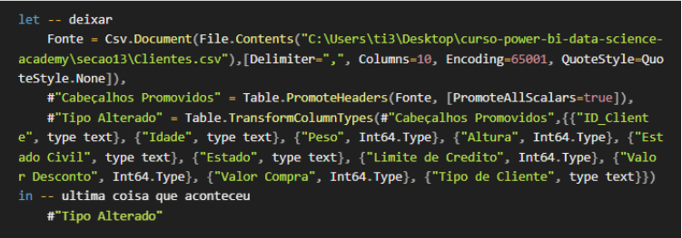

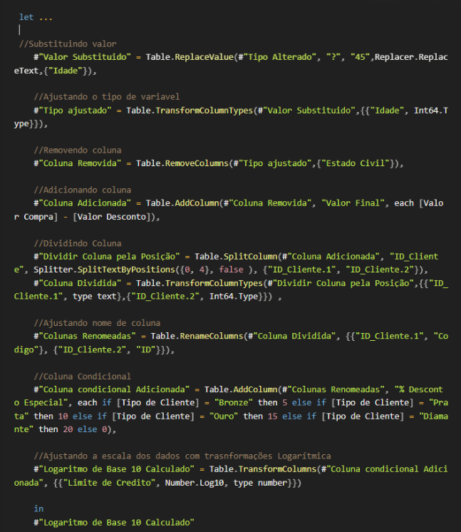

🛠 ***QUANDO USAR EXPRESSÃO DAX OU LINGUAGEM M***

- A Linguagem M, também conhecida como Power Query Formula Language, é usada principalmente para a etapa de extração, transformação e carga (ETL) dos dados no Power BI. Ela é usada para importar e manipular dados no Editor de Consultas (Query Editor) antes de carregá - los no modelo de dados. A Linguagem M é adequada para:
    - Limpar e transformar dados (como remover linhas, colunas ou preencher valores ausentes).
    - Combinar dados de diferentes fontes (como mesclar ou anexar consultas).
    - Converter tipos de dados e formatar dados (como converter texto para número ou data).
    - Aplicar transformações condicionais e agregar dados
---

- A Expressão DAX é usada principalmente para a criação de medidas, colunas calculadas e tabelas calculadas no modelo de dados do Power BI. DAX é uma linguagem de fórmula que permite realizar cálculos avançados e análise de dados. A Expressão DAX é adequada para:
    - Criar medidas dinâmicas que reagem a seleção e filtros aplicados no relatório (como vendas totais, médias, taxas de crescimento, etc.).
    - Criar colunas calculadas que se baseiam em outras colunas do modelo de dados (como colunas calculadas que combinam nome e sobrenome, por exemplo).
    - Definir tabelas calculadas com base em tabelas existentes ou medidas.
    - Realizar análises de tempo (como comparação ano a ano, análise de séries temporais, etc.).
    - Aplicar funções de contexto, como funções de filtro, iteração e avaliação, para calcular valores em diferentes níveis de granularidade

# 📌 ***Seção 14 => Power BI e Banco de Dados***

🧾 **SGBDs :** Sistemas Gerenciadores de Bancos de Dados, são softwares responsáveis por gerenciar  e  administrar  bancos  de  dados.  Eles  fornecem  um  conjunto  de  ferramentas  e funcionalidades  para  criar,  manter,  manipular,  proteger  e  otimizar  o  acesso  aos  dados armazenados. Os SGBDs facilitam a interação entre os usuários e os bancos de dados, permitindo que eles executem operações como inserção, atualização, exclusão e consulta de dados

🧾 **SGBDs RELACIONAIS**:  gerenciam  bancos  de  dados  relacionais,  onde  os  dados  são organizados em tabelas e as relações entre eles são estabelecidas por meio de chaves primárias e estrangeiras. Eles utilizam a linguage m SQL (Structured Query Language) como uma linguagem padrão para realizar consultas e manipular dados. Exemplos incluem MySQL, PostgreSQL, Oracle e SQL Server.

🧾 **SGBDs NOSQL**: gerenciam bancos de dados não relacionais que não utilizam o modelo tabular  clássico.  Eles  são  projetados  para  serem  escaláveis  e  distribuídos,  e  podem ser categorizados  em  diferentes  tipos,  como  bancos  de  dados  de  documentos  (MongoDB, Couchbase), bancos de dados de colunas (Cassandra, HBase), bancos de dados de grafos (Neo4j, OrientDB) e bancos de dados de chave - valor (Redis)

**Além de gerenciar o armazenamento e recuperação de dados, os SGBDs também são** **responsáveis  por  aspectos  como  controle  de  transações,  consistência  de dados,  integridade referencial, segurança e gerenciamento de acesso, e otimização de consultas.**

🧾 **BANCO DE DADOS RELACIONAIS:**  baseados  no  modelo  relacional,  onde  os  dados  são organizados em tabelas, e as relações entre eles são estabelecidas por meio de chaves primárias e estrangeiras. Exemplos de sistemas de gerenciamento de bancos de dados relacionais (SGBDR) incluem MySQL, PostgreSQL, Oracle e SQL Server.

🧾 **BANCO DE DADOS NOSQL**: são bancos de dados não relacionais que não utilizam o modelo tabular  clássico.  Eles  são  projetados  para  serem  escaláveis  e  distribuídos,  e  podem ser categorizados  em  diferentes  tipos,  como  bancos  de  dados  de  documentos  (MongoDB,Couchbase), bancos de dados de colunas (Cassandra, HBase), bancos de dados de grafos (Neo4j,OrientDB) e bancos de dados de chave-valor (Redis)

---

🔐 **ODBC :** é uma interface de programação de aplicativos (API) padrão que permite que aplicativos se conectam a sistemas gerenciadores de bancos de dados (SGBDs) de diferentes fornecedores, independentemente do sistema operacional, linguagem de programação ou modelo de banco de dados. ODBC foi desenvolvido pela Microsoft no início dos anos 1990 e é amplamente utilizado para fornecer acesso a uma variedade de bancos de dados, como Oracle, SQL Server, MySQL, PostgreSQL, entre outros.

A  principal  vantagem do  ODBC  é  que  ele  permite  que  os  desenvolvedores  escrevam aplicativos que podem se conectar a diferentes SGBDs sem a necessidade de modificar o código - fonte do aplicativo para cada banco de dados específico. Isso é possível porque o ODBC abstrair as  diferenças  entre  os  SGBDs  e  oferece  uma  interface  comum  para  executar  consultas  e manipular dados

***Dentro da conexão do ODBC, podemos fazer um “filtragem” avançada usando linguagem SQL, para fazer a criação de uma nova coluna trazendo apenas aquilo que está na minha consulta***

# 📌 ***Seção 15 => SQL Analytics***

🧾 **SQL:**

- **DDL** (Data Definition Language), Permite criar, alterar e excluir estruturas de banco de dados, como tabelas, índices e restrições. Exemplos de comandos: CREATE, ALTER, DROP.
- **DML**  (Data Manipulation Language), Usado para inserir, modificar, excluir e consultar dados armazenados nas tabelas. Exemplos de comandos: SELECT, INSERT, UPDATE, DELETE.
- **DCL** (Data Control Language), Fornece mecanismos para controlar o acesso aos dados e gerenciar privilégios de usuários. Exemplos de comandos: GRANT, REVOKE.
- **TCL** (Transaction Control Language), Controla as transações, garantindo a consistência e a integridade dos dados. Exemplos de comandos: COMMIT, ROLLBACK, SAVEPOINT

🧾 **SQL ANALYTICS:**  termo que se refere à análise de dados usando a linguagem SQL em conjunção com técnicas de análise de dados e ferramentas de visualização. O objetivo do SQL Analytics é ajudar as organizações a tomar decisões informadas com base em insights extraídos de grandes volumes de dados armazenados em sistemas de gerenciamento de banco de dados relacionais (SGBDs) e outras fontes de dados compatíveis com SQL

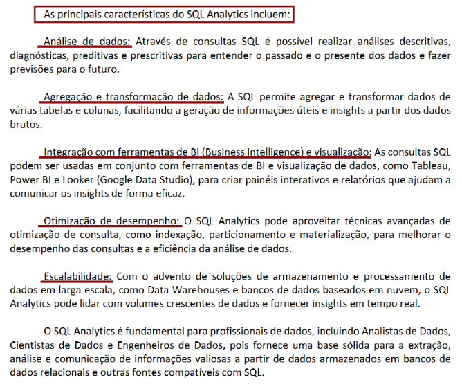

# 📌 ***Seção 16 => Machine Learning Power BI Para Segmentação de Clientes***

- **Machine Learning** (Aprendizado de Máquina, em português) é uma área da Inteligência Artificial (IA) que se concentra no desenvolvimento de algoritmos e técnicas que permitem que os computadores aprendam a executar tarefas sem serem explicitamente programados para isso. O objetivo é desenvolver modelos que possam identificar padrões, fazer previsões e tomar decisões com base nos dados fornecidos(dados históricos)

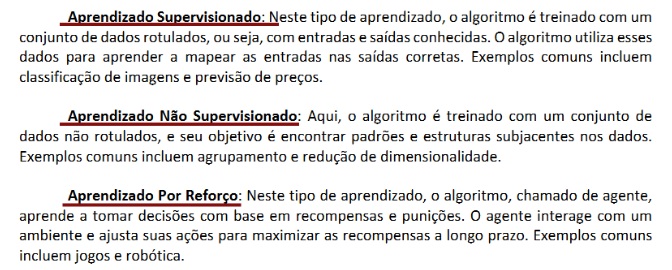

👥 **A segmentação de clientes** é o processo de dividir a base de clientes de uma empresa em grupos distintos com base em características comuns, necessidades, comportamentos ou preferências. O objetivo da segmentação é entender melhor as necessidades e desejos de diferentes grupos de clientes e, assim, adaptar as estratégias de marketing, comunicação e vendas para atender a essas necessidades de maneira mais eficaz e personalizada.

Fizemos a Instalação da Anaconda, para utilizarmos o Machine Learning

# 📌 ***Seção 17 => Machine Learning Power BI Para Detecção de Anomalias***

🚨 A detecção de anomalias, também conhecida como detecção de outliers, é uma técnica em Machine Learning e Estatística que visa identificar padrões incomuns, inesperados ou anômalos nos dados. Esses padrões podem ser diferentes das observações normais de várias maneiras, como magnitude, frequência ou comportamento. A detecção de anomalias é importante porque as anomalias podem indicar problemas, erros, falhas, fraudes ou atividades maliciosas e, em muitos casos, é crucial identificar e analisar esses eventos anômalos para tomar decisões informadas e apropriadas

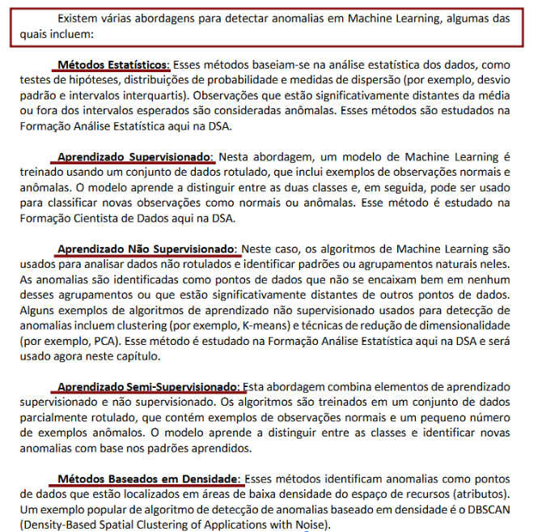

- **Linguagem R:** usada para estatística

o'que precisa instalar para utilizar a linguagem :

🔗 [cran.r-project.org](http://cran.r-project.org)

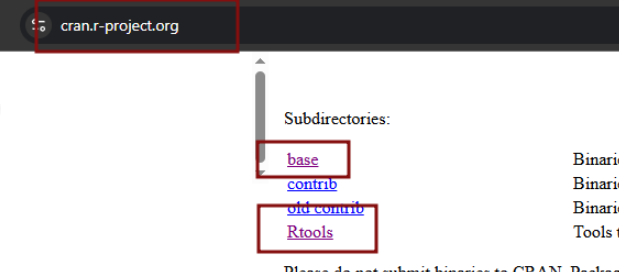

🔗   [posit.co/download/rstudio-desktop/](http://posit.co/download/rstudio-desktop/)

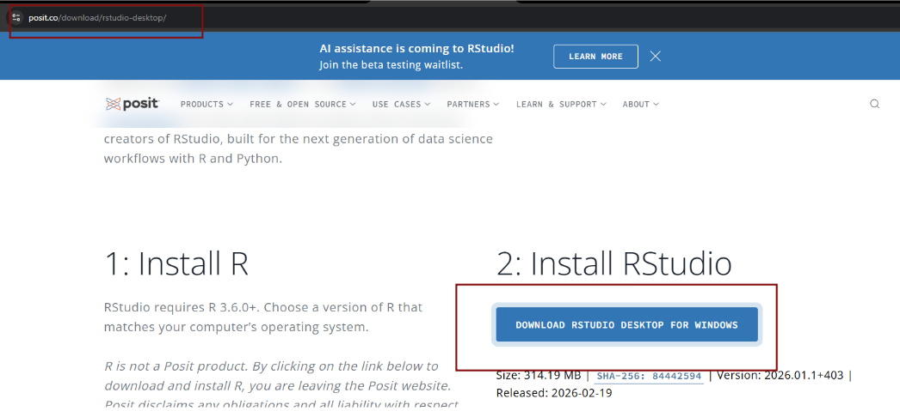

# 📌 ***Seção 18 => Inteligência Artificial e Análise de sèries Temporais com Power BI***

⏳ Séries temporais são um conjunto de pontos de dados coletados em intervalos sequenciais ao longo do tempo. Elas são usadas para prever futuros pontos de dados com base em dados históricos.

Esses  conjuntos  de  dados  são  frequentemente  coletados  em  intervalos  regulares - por exemplo,  o  preço  das ações  ao  final  de  cada  dia  de  negociação,  a  temperatura  média  diária durante um ano, as vendas mensais de uma empresa ou o PIB trimestral de um país.

A  análise  de  séries  temporais  é  uma  técnica  estatística  que  lida  com  dados  de  séries temporais  para  extrair funções  úteis  e  ajudar  na  previsão  de  dados  futuros.  Essa  análise  pode levar em conta tendências, sazonalidade e ciclos presentes nos dados.

Alguns exemplos comuns de utilização de séries temporais incluem a previsão do tempo, análise econômica, engenharia de controle de processos e muito mais

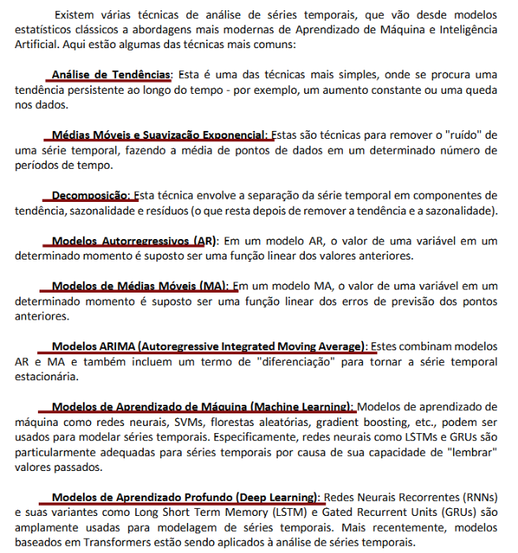

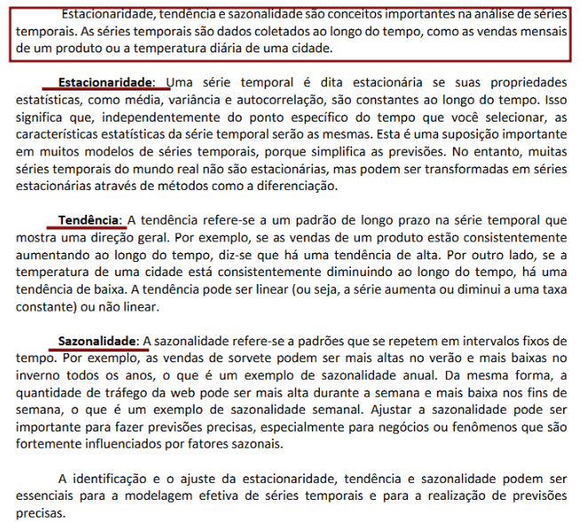

